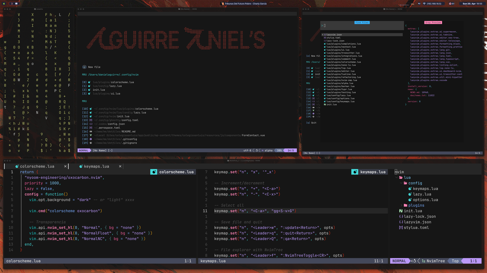

# dotfiles
Development programs configuration (iterm2, nvim, zellij) and custom UI (sketchybar, yabai), terminal IDE (iterm2, kitty), and others.
Don't use my configurations blindly unless you know what they entail! Use them at your own risk!

## Contents
- .config/
    - zellij config
    - nvim (Neovim + lazyVim + custom)
    - sketchybar
- starship config
- aerospace config
- zsh config

## Shell setup (macOS & Linux)
- Git >= **2.19.0** (for partial clones support)
- [Oh My Zsh](https://ohmyz.sh/)
- [Nerd fonts](https://github.com/ryanoasis/nerd-fonts) - Patched fonts for development-use. I use [PlemolJP](https://github.com/yuru7/PlemolJP) and BlexMono.
- [ghq](https://github.com/x-motemen/ghq) - Local Git repository organizer
- [fzf](https://github.com/PatrickF1/fzf.fish) - Interactive filtering
- UI
    - [sketchybar](https://github.com/FelixKratz/SketchyBar)
    - [AeroSpace](https://nikitabobko.github.io/AeroSpace/guide)
    - [Eza](https://github.com/eza-community/eza) - `ls` replacement
     - [yabai](URL_ADDRESS.com/koekeishiya/yabai)
- [NeoVim](https://neovim.io/) - >= **0.9.0** 
    - [LazyVim](https://www.lazyvim.org/)
    - [oxocarbon](https://github.com/nyoom-engineering/oxocarbon.nvim)
- [lazygit](https://github.com/jesseduffield/lazygit) **_(optional)_**
- for [telescope.nvim](https://github.com/nvim-telescope/telescope.nvim) **_(optional)_**
  - **live grep**: [ripgrep](https://github.com/BurntSushi/ripgrep)
  - **find files**: [fd](https://github.com/sharkdp/fd)
- Terminal
    - [Ghostty] (https://ghostty.org/)

## About me

- [@daguigonz](https://x.com/daguigonz)
- [Newsletters](https://aguirredaniels.com/)
